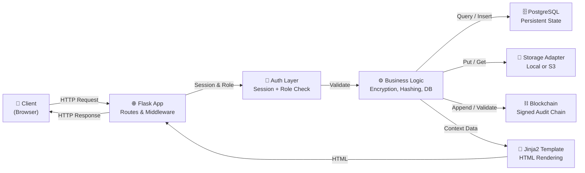
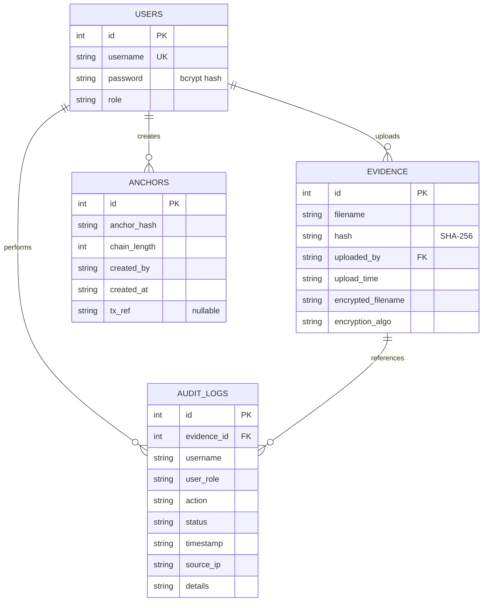
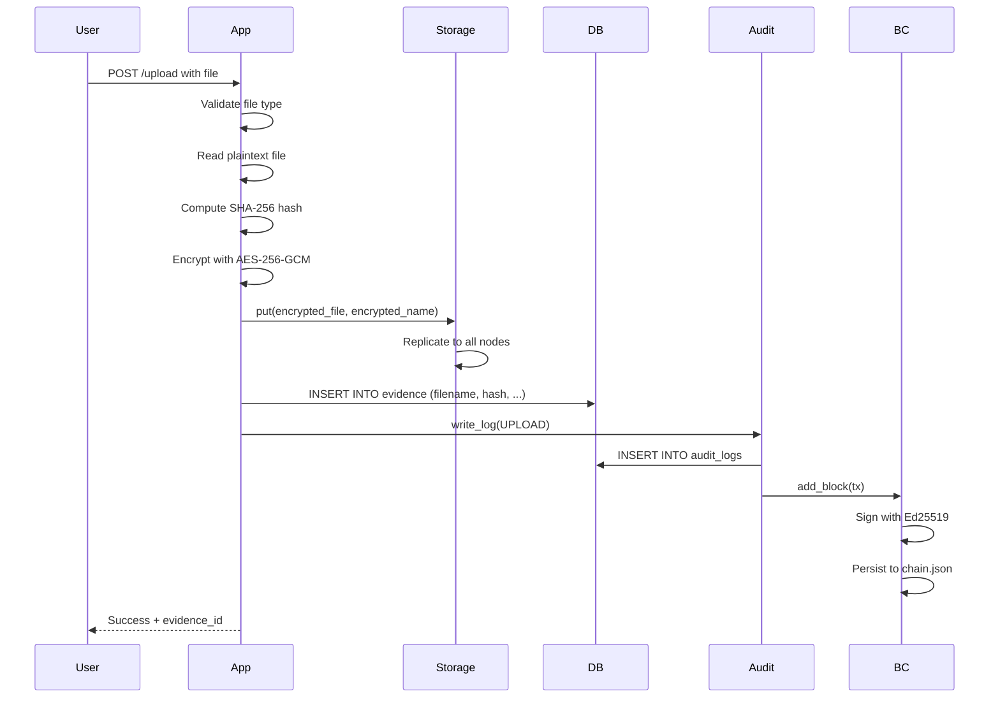
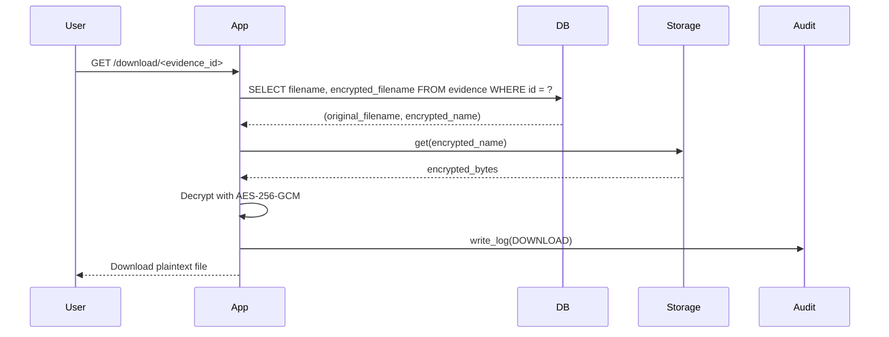
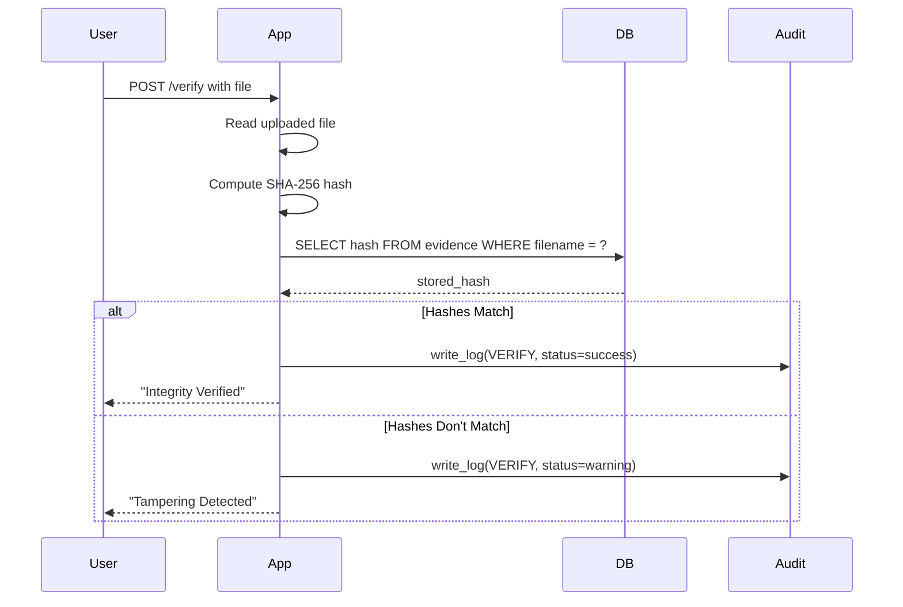

# Project Working Overview: Forensic Evidence Management System

A detailed technical guide to the architecture, design, workflows, and implementation of the forensic evidence management system.

---

## 📖 Table of Contents

1. [Project Purpose](#project-purpose)
2. [Core Modules & Responsibilities](#core-modules--responsibilities)
3. [Technology Stack](#technology-stack)
4. [Application Architecture](#application-architecture)
5. [Database Design](#database-design)
6. [Evidence Handling Pipeline](#evidence-handling-pipeline)
7. [Storage Architecture](#storage-architecture)
8. [Blockchain & Cryptography](#blockchain--cryptography)
9. [Audit Logging & Chain-of-Custody](#audit-logging--chain-of-custody)
10. [Security Architecture](#security-architecture)
11. [API Specification](#api-specification)
12. [Error Handling & Resilience](#error-handling--resilience)
13. [Deployment Architecture](#deployment-architecture)
14. [Testing & Validation](#testing--validation)
15. [Known Limitations & Future Work](#known-limitations--future-work)

---

## Project Purpose

This system is designed to serve forensic evidence management in law enforcement and legal proceedings. It addresses the critical need for:

1. **Secure evidence custody:** Encrypted storage with multi-node redundancy or cloud backup
2. **Tamper detection:** Cryptographic hashing to identify file modifications
3. **Chain-of-custody proof:** Immutable audit trail with cryptographic signing
4. **Role-based workflow:** Different access levels for investigators, analysts, courts
5. **Legal admissibility:** Comprehensive logging and timestamping for courtroom use

The system prioritizes **forensic integrity** (no hidden changes) over performance or features.

---

## Core Modules & Responsibilities

### `app.py` — Main Flask Application (~1200 lines)

**Responsibility:** Central business logic, routing, and orchestration

**Key Components:**

- **Initialization:**
  - Database connection and schema creation (`init_db()`)
  - Runtime directory setup (`ensure_runtime_dirs()`)
  - Storage adapter instantiation
  - Blockchain initialization

- **Authentication & Authorization:**
  - `login()` — Session-based login with password verification/migration
  - `verify_and_migrate_password()` — Support for legacy plaintext passwords
  - `@login_required()` decorator — Ensure user is authenticated
  - `@role_required()` decorator — Enforce permission-based access
  - `register()` — Admin-only user creation

- **Evidence Workflow:**
  - `upload()` — Accept files, hash, encrypt, replicate
  - `verify()` — UI for integrity checking
  - `evidence()` — List evidence inventory
  - `download()` — Retrieve and decrypt evidence

- **Audit & Logging:**
  - `write_log()` — Structured logging to database and blockchain
  - `write_log_file()` — Fallback plaintext logging
  - `logs()` — Queryable audit log viewer
  - `export_logs()` — CSV export for legal reporting

- **Blockchain & Anchoring:**
  - `view_blockchain()` — Dashboard for blockchain status
  - `api_anchor()` — Create anchor snapshots
  - `api_chain()` — Return full chain JSON
  - `api_validate_chain()` — Validate chain integrity

- **Health & Monitoring:**
  - `health()` — Database and storage status check

### `blockchain.py` — Append-Only Signed Ledger (~150 lines)

**Responsibility:** Off-chain tamper-evident blockchain for audit proof

**Key Classes:**

- **`Block`:** Represents a single blockchain entry
  - Fields: index, timestamp, prev_hash, transactions, signature, hash
  - Method: `to_dict()` for JSON serialization

- **`Blockchain`:** Manages the append-only chain
  - **Initialization:**
    - Loads or generates Ed25519 keypair
    - Loads existing chain from `chain.json` or creates genesis block
  - **Key Methods:**
    - `add_block(transactions)` — Append new block and persist
    - `validate()` — Verify all hashes and signatures (returns tuple: valid, message)
  - **Persistence:** JSON-based with human-readable format
  - **Cryptography:** Ed25519 signatures for non-repudiation

### `storage_adapter.py` — Pluggable Storage Backend (~250 lines)

**Responsibility:** Abstract storage operations for pluggable backends

**Key Classes:**

- **`StorageAdapter` (ABC):** Abstract base class defining interface
  - `put(local_path, remote_key)` — Store file
  - `get(remote_key, local_path=None)` — Retrieve file
  - `exists(remote_key)` — Check existence
  - `delete(remote_key)` — Delete file
  - `health_check()` — Verify backend health

- **`LocalStorageAdapter`:** Multi-node replication (default)
  - Stores encrypted files in three local directories: `node1/`, `node2/`, `node3/`
  - `put()` — Copies file to all three nodes
  - `get()` — Returns from first available node
  - `health_check()` — Reports accessible nodes and file counts

- **`S3StorageAdapter`:** AWS S3 backend (production)
  - Uses boto3 for S3 operations
  - `put()` — Uploads to bucket
  - `get()` — Downloads from bucket
  - `health_check()` — Verifies bucket accessibility

- **`get_storage_adapter()` factory function:** Returns appropriate adapter based on `STORAGE_BACKEND` env var

### Templates Directory — HTML UI

**Templates (Jinja2):**

- `login.html` — Login form
- `dashboard.html` — Role-aware navigation hub
- `register.html` — Admin user creation
- `upload.html` — Evidence submission form
- `verify.html` — Integrity checking UI
- `evidence.html` — Evidence inventory with download links
- `logs.html` — Queryable audit log viewer with filters
- `blockchain.html` — Blockchain status, recent blocks, anchors
- `error.html` — Shared error page (403, 404, 5xx)

**Common Elements:**
- Navigation bar with role badge
- Session check and logout
- CSRF protection (Flask-Jinja2 support)
- Responsive CSS styling (`static/style.css`)

---

## Technology Stack

| Layer | Technology | Purpose |
|-------|-----------|---------|
| **Web Framework** | Flask 3.1.0 | Lightweight Python web framework |
| **Database** | PostgreSQL | Persistent storage (users, evidence, audit logs, anchors) |
| **Authentication** | bcrypt | Secure password hashing |
| **Encryption** | cryptography (AES-GCM, Ed25519) | File encryption and blockchain signing |
| **Storage** | Local/S3 | Evidence file storage with pluggable backends |
| **Templating** | Jinja2 | Server-rendered HTML |
| **API** | Flask JSON | REST API for programmatic access |
| **Environment** | python-dotenv | Configuration from .env file |
| **ORM / DB Driver** | psycopg (PEP 249) | Direct PostgreSQL connection |
| **Deployment** | Vercel (optional) | Serverless hosting for Flask app |

---

## Application Architecture

### Request/Response Flow Diagram



### Key Design Patterns

1. **Decorator-based authorization:** `@login_required`, `@role_required()` ensure permission checks before handler execution
2. **Factory pattern:** `get_storage_adapter()` abstracts backend selection
3. **Adapter pattern:** `StorageAdapter` interface allows pluggable backends
4. **Separation of concerns:** Database, encryption, logging, and blockchain are separate modules
5. **Fail-safe logging:** If database logs fail, fallback to plaintext file

---

## Database Design

### Schema Overview



### Table Details

#### `users`
- **Purpose:** Stores user accounts and roles
- **Key Fields:**
  - `id`: Auto-incrementing primary key
  - `username`: Unique identifier (required)
  - `password`: bcrypt hash (empty plaintext not accepted)
  - `role`: One of [admin, police_officer, forensic_analyst, court_authority]
- **Default:** One admin account seeded on init if none exists (admin:admin123)

#### `evidence`
- **Purpose:** Metadata for uploaded evidence files
- **Key Fields:**
  - `id`: Auto-incrementing primary key
  - `filename`: Original filename (user-provided, sanitized)
  - `hash`: SHA-256 of original plaintext file (NOT encrypted file)
  - `uploaded_by`: Username of uploader
  - `upload_time`: ISO timestamp
  - `encrypted_filename`: Stored name in storage backend (e.g., `evidence.pdf.enc`)
  - `encryption_algo`: Algorithm used (e.g., "AES-256-GCM")
- **Constraints:** No unique constraint on filename (may be duplicated by different users or times)

#### `audit_logs`
- **Purpose:** Chain-of-custody trail; every significant action logged
- **Key Fields:**
  - `id`: Auto-incrementing primary key
  - `evidence_id`: Foreign key to evidence (nullable; not all actions relate to evidence)
  - `username`: Who performed the action
  - `user_role`: Their role at the time (for context)
  - `action`: Type of action (LOGIN, UPLOAD, DOWNLOAD, VERIFY, CREATE_USER, ACCESS_DENIED, EXPORT_LOGS, ANCHOR, VIEW_BLOCKCHAIN)
  - `status`: success, failure, or warning
  - `timestamp`: ISO timestamp with microseconds
  - `source_ip`: Client IP address
  - `details`: JSON-like or free-form additional context
- **No deletions:** Audit logs are immutable (no UPDATE or DELETE)

#### `anchors`
- **Purpose:** Snapshots of blockchain state at critical moments
- **Key Fields:**
  - `id`: Auto-incrementing primary key
  - `anchor_hash`: Hash of chain head at moment of creation
  - `chain_length`: Total number of blocks in chain
  - `created_by`: Username of anchor creator
  - `created_at`: ISO timestamp
  - `tx_ref`: Optional external transaction reference (for notarization)
- **No deletions:** Anchors are immutable

### Query Patterns

**High-frequency queries:**
1. Evidence lookup by filename → `SELECT * FROM evidence WHERE filename = %s`
2. Audit log filtering → `SELECT * FROM audit_logs WHERE action = %s AND timestamp > %s ORDER BY timestamp DESC`
3. Verify password → `SELECT password, role FROM users WHERE username = %s`
4. Check admin exists → `SELECT COUNT(*) FROM users WHERE role = 'admin'`

**Indexed for performance:**
- `evidence(filename)`, `evidence(upload_time)`
- `audit_logs(timestamp)`, `audit_logs(action)`, `audit_logs(username)`, `audit_logs(evidence_id)`
- `anchors(created_at)`

---

## Evidence Handling Pipeline

### Upload Flow (Detailed)



**Steps in detail:**

1. **Receive & Validate**
   - Accept file from form upload
   - Check file is not empty
   - Check extension against `ALLOWED_EXTENSIONS`
   - Sanitize filename with `os.path.basename()`

2. **Compute Hash**
   - Read plaintext file in chunks (65KB blocks)
   - Compute SHA-256 incrementally to support large files
   - Store hash for later verification

3. **Encrypt**
   - Generate 12-byte random nonce
   - Encrypt plaintext using AES-256-GCM with app key
   - Format: nonce (12 bytes) + ciphertext (includes auth tag)
   - Save to temporary file

4. **Replicate / Store**
   - Call `storage_adapter.put()` with encrypted temp file
   - **Local backend:** Copies to `node1/`, `node2/`, `node3/`
   - **S3 backend:** Uploads to bucket
   - Delete temporary local file

5. **Store Metadata**
   - INSERT into `evidence` table with:
     - Original filename
     - Hash (of plaintext)
     - Uploader username
     - Timestamp
     - Encrypted filename (for retrieval)
     - Encryption algorithm
   - Get auto-generated `evidence_id`

6. **Log to Audit Trail**
   - Call `write_log()` with action=UPLOAD, evidence_id, status=success
   - Writes to `audit_logs` table
   - Attempts to append to blockchain block
   - If blockchain fails, fallback to plaintext log file

7. **Respond**
   - Render success page with evidence_id and confirmation

### Download & Decrypt Flow



**Steps:**

1. **Look up metadata:** Query evidence table by ID
2. **Retrieve encrypted file:** Call `storage_adapter.get(encrypted_name)` (returns bytes)
3. **Decrypt:** 
   - Extract 12-byte nonce from first 12 bytes
   - Decrypt remainder using AES-256-GCM
   - Returns plaintext bytes
4. **Log:** Record DOWNLOAD action to audit trail and blockchain
5. **Stream to browser:** Send plaintext file as attachment

### Verification Flow



**Steps:**

1. **Accept file:** User uploads suspected file via /verify form
2. **Hash:** Compute SHA-256 of uploaded file
3. **Lookup:** Query `evidence` table by filename (finds latest record)
4. **Compare:** Compare computed hash with stored hash
5. **Log result:** Record outcome to audit trail
6. **Display:** Show pass/fail result to user

**Note:** Current implementation matches evidence by filename. If multiple records with same filename exist, the latest (by ID) is used. This could be ambiguous and is noted as a limitation.

---

## Storage Architecture

### Local Storage Backend (Multi-Node Replication)

**Default.** Encrypted files replicated to three local directories for fault tolerance.

**Directory Structure:**
```
RUNTIME_DATA_DIR/
├── storage_nodes/
│   ├── node1/              # Replica 1
│   ├── node2/              # Replica 2
│   └── node3/              # Replica 3
├── blockchain/
│   ├── chain.json          # Blockchain ledger
│   └── key.pem             # Ed25519 private key
└── audit_logs/
    └── audit.log           # Fallback plaintext log
```

**Put operation:**
```python
for node_dir in [node1, node2, node3]:
    shutil.copy(encrypted_file, f"{node_dir}/{remote_key}")
```

**Get operation:**
```python
for node_dir in [node1, node2, node3]:
    if file exists in node_dir:
        return file contents
raise FileNotFoundError
```

**Advantages:**
- No cloud dependency or setup
- Zero latency for local access
- Good for development and small deployments

**Disadvantages:**
- No redundancy if single machine fails
- Limited scalability
- Manual backup management

### S3 Storage Backend (Production)

**AWS S3** for cloud-scale storage with built-in redundancy and durability.

**Configuration:**
```bash
export STORAGE_BACKEND=s3
export S3_BUCKET_NAME=my-forensic-bucket
export AWS_REGION=us-west-2
```

**AWS credentials (one of):**
- Environment variables: `AWS_ACCESS_KEY_ID`, `AWS_SECRET_ACCESS_KEY`
- `~/.aws/credentials` file
- IAM role (recommended for production)

**Put operation:**
```python
s3_client.upload_file(local_path, bucket_name, remote_key)
```

**Get operation:**
```python
response = s3_client.get_object(Bucket=bucket_name, Key=remote_key)
return response["Body"].read()
```

**Health check:**
```python
s3_client.head_bucket(Bucket=bucket_name)  # Verifies access
```

**Advantages:**
- Highly available and durable (99.9% SLA)
- Automatic replication across regions
- Versioning and lifecycle policies
- Cost-effective at scale
- Managed backups

**Disadvantages:**
- Requires AWS account and credentials
- Network latency
- S3 API rate limits

### Storage Adapter Interface

**Abstract methods:**
- `put(local_path, remote_key)` — Store file
- `get(remote_key, local_path=None)` — Retrieve file (returns bytes if no local_path)
- `exists(remote_key)` — Check existence
- `delete(remote_key)` — Delete file (currently unused)
- `health_check()` — Return dict with `{"healthy": bool, "message": str, ...}`

**Adding new backend (e.g., Azure Blob Storage):**
1. Create class extending `StorageAdapter`
2. Implement all abstract methods
3. Update `get_storage_adapter()` factory to recognize env var
4. Update tests and documentation

---

## Blockchain & Cryptography

### Blockchain Data Structure

**Block JSON format:**
```json
{
  "index": 5,
  "timestamp": "2026-05-03 14:30:00.123456+00:00",
  "prev_hash": "a7f3e2c8...(64 hex chars)",
  "transactions": [
    {
      "username": "alice",
      "user_role": "police_officer",
      "action": "UPLOAD",
      "status": "success",
      "timestamp": "2026-05-03 14:30:00.000000",
      "source_ip": "192.168.1.100",
      "evidence_id": 1,
      "details": "Filename: evidence.pdf, Encrypted: evidence.pdf.enc"
    }
  ],
  "signer_pub": "abcd1234...(64 hex chars, Ed25519 public key)",
  "signature": "xyz789...(128 hex chars, Ed25519 signature)",
  "hash": "f5q8r2t9...(64 hex chars)"
}
```

**Chain file format:**
```json
[
  { ...block 0 (genesis)... },
  { ...block 1... },
  ...
]
```

### Cryptographic Operations

#### Hash Calculation

**Block hash** is computed from:
```
payload = f"{index}|{timestamp}|{prev_hash}|{transactions_hash}"
block_hash = SHA-256(payload)  // 64-char hex string
```

**Transactions hash:**
```
tx_json = json.dumps(transactions, sorted, no_spaces)
tx_hash = SHA-256(tx_json)  // 64-char hex string
```

#### Signing

**Ed25519 signature:**
```
signature = ED25519_SIGN(private_key, block_hash.encode())
signature_hex = signature.hex()  // 128-char hex string
```

**Verification (public key):**
```
public_key.verify(signature_bytes, block_hash.encode())
# Raises exception if signature invalid
```

### Validation Algorithm

```
for each block (starting from index 1):
  1. Check prev_hash == previous_block.hash
     └─ If not, block chain is broken
  
  2. Recalculate block hash from current data
     └─ If mismatch, block was tampered with
  
  3. Reconstruct public key from signer_pub hex
     └─ Verify signature against current block hash
     └─ If invalid, block was modified or signature forged
     
if all checks pass:
  return (True, "chain valid")
else:
  return (False, "detailed error message")
```

### Key Management

**Private Key:**
- Location: `blockchain/key.pem`
- Format: PEM-encoded PKCS#8 Ed25519 private key
- Created automatically on first run
- **MUST NOT** be committed to git (add to `.gitignore`)
- **If exposed:** Rotate immediately

**Public Key:**
- Stored in every block (`signer_pub` field)
- Extracted on `/blockchain` dashboard for auditors
- Used to verify signatures externally

### Key Rotation Procedure

**If private key is exposed (e.g., pushed to github):**

1. **Generate new keypair:**
   ```python
   from cryptography.hazmat.primitives.asymmetric.ed25519 import Ed25519PrivateKey
   priv = Ed25519PrivateKey.generate()
   pub = priv.public_key()
   # Save priv to blockchain/key.pem
   # Publish pub to auditors
   ```

2. **Delete old blockchain (optional):**
   ```bash
   rm blockchain/chain.json  # Starts fresh
   ```

3. **Update deployment:**
   - Restart all running instances
   - Provide new public key to external auditors
   - Mark old public key as compromised in documentation

4. **Document transition:**
   - Record when rotation occurred
   - Explain which blocks were signed with old key
   - New blocks signed with new key

---

## Audit Logging & Chain-of-Custody

### Dual Logging Architecture

**Two parallel audit trails for resilience:**

```
User Action
     ↓
[Try to log to PostgreSQL]
     ├─ Success: INSERT audit_logs + append to blockchain
     └─ Failure: Fallback write_log_file()
```

**PostgreSQL (Primary):**
- Structured queries and filtering
- Indexed by action, username, timestamp, evidence_id
- Used for `/logs` UI and exports
- Persistent and queryable

**Plaintext file (Fallback):**
- Legacy support and resilience
- Simple format: `[timestamp] USER:username ACTION:action`
- No queryability; for manual inspection only
- Triggers only if database transaction fails

### Logged Actions

| Action | Trigger | Example Details |
|--------|---------|-----------------|
| LOGIN | User enters credentials | success/failure |
| LOGOUT | User clicks logout | — |
| UPLOAD | File submitted | evidence_id, filename |
| DOWNLOAD | File downloaded | evidence_id, filename |
| VERIFY | Integrity checked | evidence_id, result (PASSED/TAMPER_DETECTED) |
| CREATE_USER | Admin creates account | username, role |
| ACCESS_DENIED | Permission check fails | permission, reason |
| EXPORT_LOGS | CSV export | record_count |
| ANCHOR | Blockchain anchor created | anchor_id, chain_length |
| VIEW_BLOCKCHAIN | Dashboard accessed | chain_length |
| PASSWORD_HASH_UPGRADE | Plaintext password migrated | — |
| VERIFY_API | API hash verification | evidence_id, result |
| BLOCKCHAIN_APPEND_FAILED | Fallback triggered | reason |

### Log Fields

Each audit_logs entry captures:
- **username:** Who performed action
- **user_role:** Their role at time of action
- **action:** What was done
- **status:** success, failure, or warning
- **timestamp:** ISO format with microseconds
- **source_ip:** Client IP (from X-Forwarded-For or connection)
- **evidence_id:** Optional link to evidence
- **details:** Free-form context (JSON-like or plain text)

### Filtering & Export

**Log filtering supports:**
- By username (partial match)
- By action (exact match)
- By evidence filename (partial match)
- By status (exact match)

**CSV export includes:**
- All audit_logs fields
- Joined evidence filename (if applicable)
- Exported with timestamp in filename

---

## Security Architecture

### Authentication Layer

**Session-based approach:**
1. User submits username + password to `/login`
2. App queries `users` table
3. Password verified using `bcrypt.checkpw()`
4. On success: username and role stored in Flask session
5. Session cookie returned to browser

**Password handling:**
- **New accounts:** bcrypt hash (cost=12)
- **Existing plaintext:** Accepted on first login, then upgraded to bcrypt
- **Future logins:** Plaintext never accepted again

**Password migration example:**
```
User with plaintext password "secret123":
  1. Login attempt with "secret123"
  2. Check: is_bcrypt? No. is_plaintext_match? Yes.
  3. Upgrade: hash_now = bcrypt("secret123")
  4. UPDATE users SET password = hash_now WHERE username = ?
  5. Log: PASSWORD_HASH_UPGRADE
  6. Grant session
```

### Authorization Layer

**Role-based access control:**
- 4 roles: admin, police_officer, forensic_analyst, court_authority
- Each role has explicit permission set
- Checked via `@role_required("permission")` decorator
- Violation logged as ACCESS_DENIED with audit trail

**Permission matrix:**
```
             Admin  PO  FA  CA
upload         ✅   ✅   ❌   ❌
verify         ✅   ✅   ✅   ❌
logs           ✅   ✅   ✅   ✅
manage_users   ✅   ❌   ❌   ❌
evidence       ✅   ✅   ✅   ✅
download       ✅   ✅   ✅   ✅
```

### Data Protection

**Encryption at rest:**
- Evidence files: AES-256-GCM with 12-byte nonce
- Key management: From env var or derived from SECRET_KEY
- Format: nonce (12 bytes) + ciphertext (includes auth tag)

**Encryption in transit:**
- **Development:** Unencrypted HTTP (debug mode)
- **Production:** HTTPS required (enforced outside Flask)
- Flask session: Signed with SECRET_KEY

**Database storage:**
- Metadata plaintext (for filtering)
- Evidence files encrypted before storage
- Passwords: bcrypt hashes only
- No plaintext sensitive data in database

### Source IP Logging

**For chain-of-custody audit:**
- `get_remote_ip()` extracts client IP
- Checks X-Forwarded-For header first (for proxies)
- Falls back to request.remote_addr
- Logged with every action

---

## API Specification

### Versioning & Response Format

**All responses:**
```json
{
  "version": "v1",
  "data": {...}  // or "error": "code"
}
```

### Endpoints

#### `GET /health` (Public)
Health check; no authentication required.
```
Response:
{
  "app": "forensic-evidence-manager",
  "timestamp": "2026-05-03 14:30:00.123456",
  "database": "ok (5 users)",
  "storage": { "healthy": true, "message": "...", "backend": "local|s3" }
}
HTTP Status: 200 (OK) or 503 (Unavailable)
```

#### `GET /api/v1/health` (Authenticated)
Versioned health endpoint.
```
Response:
{
  "version": "v1",
  "health": { ...same as /health... }
}
```

#### `GET /api/v1/evidence` (Requires: evidence permission)
List evidence with pagination.
```
Query Parameters:
  limit (1-100, default 50)

Response:
{
  "version": "v1",
  "count": 3,
  "items": [
    {
      "id": 1,
      "filename": "evidence.pdf",
      "uploaded_by": "alice",
      "upload_time": "2026-05-03 10:00:00",
      "encryption_algo": "AES-256-GCM"
    }
  ]
}
HTTP Status: 200 (OK)
```

#### `POST /api/v1/verify/hash` (Requires: verify permission)
Verify file by comparing SHA-256.
```
Request Body:
{
  "filename": "evidence.pdf",
  "sha256": "a1b2c3d4...64_hex_chars"
}

Response (success):
{
  "version": "v1",
  "filename": "evidence.pdf",
  "evidence_id": 1,
  "verified": true,
  "message": "Integrity Verified"
}

Response (tampering):
{
  "version": "v1",
  "filename": "evidence.pdf",
  "evidence_id": 1,
  "verified": false,
  "message": "Tampering Detected"
}

HTTP Status: 200 (OK) or 404 (Not Found) or 400 (Bad Request)
```

#### `GET /api/v1/chain` (Requires: logs permission)
Retrieve full blockchain JSON.
```
Response:
{
  "version": "v1",
  "count": 42,
  "chain": [
    {
      "index": 0,
      "timestamp": "...",
      "prev_hash": "...",
      "transactions": [...],
      "signer_pub": "...",
      "signature": "...",
      "hash": "..."
    },
    ...
  ]
}
HTTP Status: 200 (OK)
```

#### `GET /api/v1/validate-chain` (Requires: logs permission)
Validate chain integrity (all hashes and signatures).
```
Response (valid):
{
  "version": "v1",
  "valid": true,
  "message": "chain valid"
}

Response (invalid):
{
  "version": "v1",
  "valid": false,
  "message": "Hash mismatch at index 5"
}
HTTP Status: 200 (OK)
```

#### `POST /api/v1/anchor` (Requires: manage_users permission)
Create blockchain anchor snapshot.
```
Request Body: {} (empty)

Response:
{
  "version": "v1",
  "anchor_id": 5,
  "anchor_hash": "275b709ebdf3834f5cc210789a544c175979d924ea147b741b47f50650672c49",
  "chain_length": 42,
  "created_at": "2026-05-03 14:30:00.000000"
}
HTTP Status: 200 (OK) or 500 (Error)
```

---

## Error Handling & Resilience

### Database Connection Failures

**Scenario:** PostgreSQL unavailable during critical operation

**Handling:**
1. Catch `psycopg.Error` in write_log()
2. Fallback to write_log_file() (plaintext log)
3. Continue processing (don't crash)
4. Log warning with error details

**Example:**
```python
try:
    # INSERT into audit_logs
    conn.commit()
except psycopg.Error as e:
    write_log_file(user, f"DB_ERROR: {str(e)}")
    # Main operation continues
```

### Blockchain Persistence Failures

**Scenario:** Blockchain file I/O fails during add_block()

**Handling:**
1. Catch exception in evidence_chain.add_block()
2. Fallback to plaintext log
3. Don't fail the main request
4. Log the failure for investigation

### Storage Backend Failures

**Scenario:** S3 upload times out or local node is inaccessible

**Handling:**
1. Catch exception from storage_adapter.put()
2. Return 500 error to user
3. Log to audit trail with error details
4. User must retry

**Future improvement:** Implement retry logic with exponential backoff

### File System Failures

**Scenario:** Disk full, permission denied, etc.

**Handling:**
1. Catch exceptions during temp file creation/cleanup
2. Log error
3. Return 500 error
4. Alert operator (via health check)

### Encryption Key Issues

**Scenario:** EVIDENCE_AES_KEY malformed or missing

**Handling:**
1. At startup: validate `get_encryption_key()`
2. If invalid: raise RuntimeError (app won't start)
3. If missing: use derived key (development only)
4. At runtime: catch decryption failures, return 500

---

## Deployment Architecture

### Local Development

**How to run:**
```bash
python app.py
# Starts on http://localhost:5000 with debug=True
# Auto-reloads on code changes
# Logs printed to console
```

**Runtime data location:** Project directory (RUNTIME_DATA_DIR defaults to `.`)

### Vercel (Serverless)

**Structure:**
- `api/index.py` — Entry point (Flask app wrapper)
- `vercel.json` — Build and routing config

**Build process:**
1. Vercel detects `@vercel/python`
2. Creates venv and installs `requirements.txt`
3. Builds Flask app from `api/index.py`

**Environment variables (on Vercel):**
- `DATABASE_URL` — PostgreSQL connection
- `SECRET_KEY` — Flask session key
- `STORAGE_BACKEND` — local or s3
- `S3_BUCKET_NAME`, `AWS_REGION` (if S3)
- AWS credentials (via GitHub secrets or integration)

**Runtime data location:** `/tmp/forensic2` (Vercel's temp filesystem, ephemeral)

**Limitations:**
- `/tmp` is ephemeral; blockchain and local nodes lost on redeploy
- **Recommendation:** Use S3 for production storage, PostgreSQL for persistent metadata

### Docker (Optional)

**Dockerfile:**
```dockerfile
FROM python:3.11-slim
WORKDIR /app
COPY requirements.txt .
RUN pip install -r requirements.txt
COPY . .
EXPOSE 5000
CMD ["python", "app.py"]
```

**Build & run:**
```bash
docker build -t forensic-app .
docker run -p 5000:5000 --env-file .env forensic-app
```

**Production notes:**
- Mount volume for blockchain data (or use S3)
- Use reverse proxy (nginx) for HTTPS
- Configure logging to external service
- Set `debug=False` in app.run()

---

## Testing & Validation

### Manual Testing Checklist

**Authentication:**
- [ ] Login with admin/admin123
- [ ] Login with wrong password (fails)
- [ ] Plaintext password upgrades to bcrypt
- [ ] Register new user (admin-only)
- [ ] Unauthorized user cannot register
- [ ] Logout clears session

**Evidence Upload:**
- [ ] Upload allowed file type (PDF)
- [ ] Reject disallowed file type
- [ ] Hash is computed and stored
- [ ] File is encrypted and replicated
- [ ] Metadata appears in /evidence
- [ ] Audit log entry created

**Integrity Verify:**
- [ ] Upload same file → "Verified"
- [ ] Upload modified file → "Tampering Detected"
- [ ] Result logged to audit trail
- [ ] API endpoint returns correct JSON

**Audit Logs:**
- [ ] All actions logged with correct details
- [ ] Filters work (user, action, status)
- [ ] CSV export includes all records
- [ ] Pagination works

**Blockchain:**
- [ ] Chain initializes with genesis block
- [ ] New blocks appended on each action
- [ ] `/api/v1/validate-chain` returns valid
- [ ] Public key accessible on dashboard
- [ ] Anchor creation stores to database
- [ ] Manual tampering detected by validation

**Storage Backends:**
- [ ] Local: Files replicated to 3 nodes
- [ ] Local: Health check shows all nodes
- [ ] S3: Files uploaded to bucket (with AWS setup)
- [ ] S3: Health check verifies bucket access

### Unit Tests

**File:** `tests/test_blockchain.py` (if exists)

**Coverage:**
- Block creation and hashing
- Blockchain append and persistence
- Chain validation (hashes, signatures)
- Signature verification

---

## Known Limitations & Future Work

### Current Limitations

1. **Filename-based evidence lookup:**
   - Verification matches evidence by filename, not ID
   - Ambiguous if multiple records with same filename exist
   - **Fix:** Use evidence_id instead of filename

2. **No evidence versioning:**
   - Can't replace or update evidence
   - Historical versions not tracked
   - **Future:** Add update workflow with versioning

3. **No evidence deletion:**
   - Deleted evidence would break audit trail
   - Storage space grows indefinitely
   - **Future:** Archive old evidence (soft delete) with retention policy

4. **Blockchain is off-chain:**
   - No external blockchain notarization
   - No public proof of evidence existence
   - **Future:** Optional anchoring to public blockchain (Bitcoin, Ethereum)

5. **Local storage not resilient:**
   - Single machine failure = data loss
   - No replication to remote machines
   - **Mitigation:** Use S3 in production

6. **Timeserver dependency:**
   - Timestamps rely on local system clock
   - Skewed clock = audit trail timestamps invalid
   - **Mitigation:** Use NTP; audit external timestamps

7. **No multi-factor authentication:**
   - Password-only auth
   - No TOTP, U2F, hardware keys
   - **Future:** Add MFA support

8. **No encryption key rotation:**
   - AES key derived from SECRET_KEY
   - Changing SECRET_KEY breaks old files
   - **Future:** Support multiple keys with versioning

### Roadmap / Future Work

**Short-term (High Priority):**
- [ ] Switch verification from filename to evidence_id
- [ ] Add retry logic for storage operations
- [ ] Implement evidence archival (soft delete)
- [ ] Add proper logging to external service (Sentry, CloudWatch)
- [ ] Support for file types beyond predefined list (configurable)

**Medium-term (Medium Priority):**
- [ ] Multi-factor authentication (TOTP, FIDO2)
- [ ] Blockchain anchoring to public ledger (Bitcoin)
- [ ] Evidence versioning and update workflow
- [ ] Advanced search and analytics
- [ ] Performance optimization for large files

**Long-term (Lower Priority):**
- [ ] Mobile app for field evidence capture
- [ ] Blockchain integration with Hyperledger Fabric
- [ ] Machine learning for anomaly detection in audit logs
- [ ] Geographic distribution (multi-region storage)
- [ ] Full ISO 27001 / NIST compliance certification

---

## Summary

This forensic evidence management system combines **secure storage**, **tamper-proof auditing**, and **cryptographic verification** to provide a defensible chain-of-custody for digital evidence in legal proceedings.

**Core strengths:**
- AES-256 encryption at rest
- SHA-256 integrity hashing
- Ed25519-signed blockchain
- Comprehensive audit trail
- Role-based access control
- Pluggable storage backends

**Deployment considerations:**
- PostgreSQL required (Supabase recommended)
- S3 recommended for production storage
- Blockchain data ephemeral on Vercel (use persistent storage)
- Regular security audits recommended
- Key rotation procedure documented

For detailed implementation guide, see `README.md`. For blockchain verification and key rotation, see `BLOCKCHAIN_EXPLAINED.md`. For storage backend configuration, see `STORAGE_BACKENDS.md`.

---

**Last Updated:** 2026-05-03
